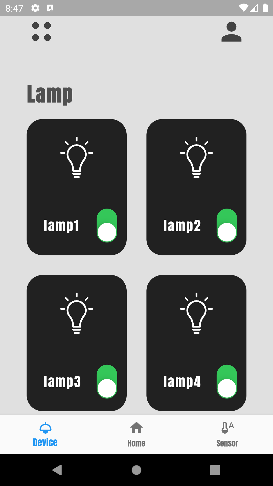

# MODERN SMART HOME x FLUTTER
 
Real-Time Smart Home Application: Take Control of Your Home with a Touch!

The Real-Time Smart Home Application, developed using Flutter, transforms your home into a smart living space, making your daily life easier. This innovative app integrates with an API and an Arduino-based control unit, allowing you to remotely control electrical devices in your home and monitor sensor data in real time.

With this application, you can effortlessly control your lights, adjust the thermostat, and even keep an eye on your security cameras, all while you're away from home. Additionally, you can monitor crucial sensor data such as temperature, humidity, and light levels, enabling you to optimize the atmosphere and energy efficiency of your living environment.

The Real-Time Smart Home Application features a user-friendly interface, offering intuitive controls like buttons and sliders for seamless interaction. By receiving real-time data updates, you can stay informed about any changes in your home and make timely adjustments to enhance energy efficiency.

This application prioritizes security and includes robust authentication mechanisms, ensuring the protection of your home. Compatible with both Android and iOS devices, the Real-Time Smart Home Application puts complete control of your home in the palm of your hand.

Experience the power of home automation with the Real-Time Smart Home Application. Simplify your daily routines, save energy, and enhance the security of your home.

 

  
  

